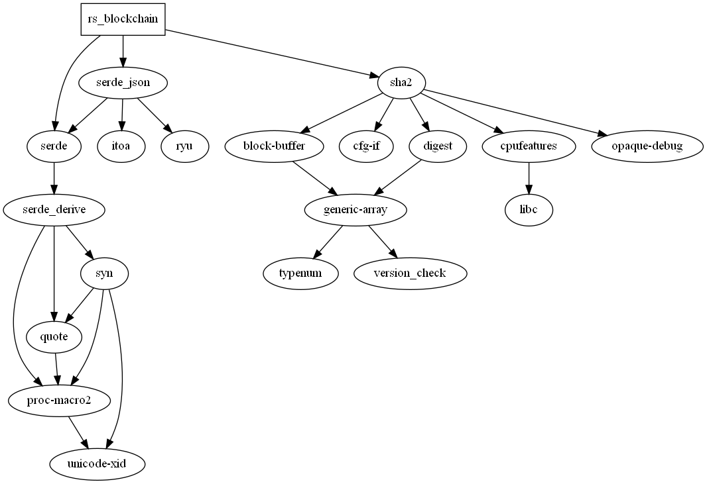

## Rust Blockchain
[![crate][crate-image]][crate-link]
[![Docs][docs-image]][docs-link]
![MIT licensed][license-image]
![Rust Version][rustc-image]
![Build Status][build-image]

Blockchain crate for the Rust programming language.

This library was inspired by this [tutorial](https://www.activestate.com/blog/how-to-build-a-blockchain-in-python).

## Can you show me how to use this crate?

Here's an example to get started
```rust
use std::env;

use rs_blockchain::add_transaction;
use rs_blockchain::rust_blockchain::blockchain::Blockchain;
use rs_blockchain::Unwrap;

fn main() -> Result<(), Box<dyn std::error::Error>> {
    let args: Vec<String> = env::args().collect();
    let mut new_blockchain = Blockchain::init();
    let mut collected_args: String = String::new();

    for arg in args[0..].iter() {
        collected_args.push_str(arg);
    }

    let amount = rs_blockchain::remove_non_digits(&collected_args).arg_unwrap();

    new_blockchain.set_difficulty(4);
    println!("{}", rs_blockchain::VERSION_INFO);

    if amount != 0 {
        for i in 1..=amount {
            add_transaction!(
                new_blockchain, "Jane Doe" => "John Doe", i as f32,
                new_blockchain, "John Doe" => "Jane Doe", 1 << i,
            );
            new_blockchain.mine();
        }
    } else {
        for i in 1..=25 {
            add_transaction!(
                new_blockchain, "Jane Doe" => "John Doe", i as f32,
                new_blockchain, "John Doe" => "Jane Doe", 1 << i,
            );
            new_blockchain.mine();
        }
    }

    new_blockchain.list_transactions();
    new_blockchain.write_chain_to_file()?;
    Ok(())
}

```

## Can I contribute to this project?
Of course, anyone can!

## Dependency Graph


[crate-image]: https://img.shields.io/crates/v/rs_blockchain.svg
[crate-link]: https://crates.io/crates/rs_blockchain.svg
[docs-image]: https://docs.rs/rs_blockchain/badge.svg
[docs-link]: https://docs.rs/rs_blockchain/
[license-image]: https://img.shields.io/badge/license-MIT-blue.svg
[rustc-image]: https://img.shields.io/badge/Rust-1.8+-blue.svg
[build-image]: https://github.com/Pavlos-Efstathiou/Rust-Blockchain/actions/workflows/rust.yaml/badge.svg